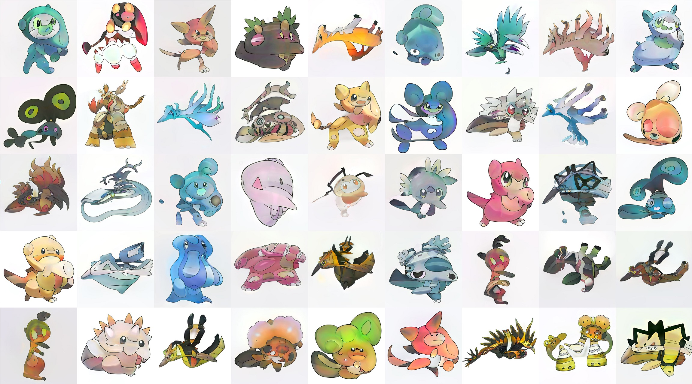
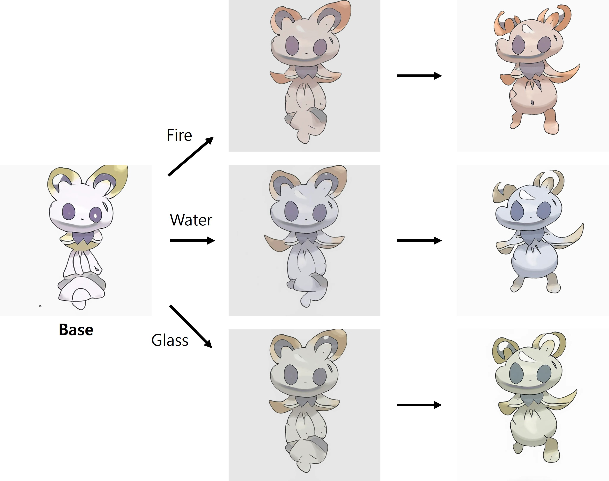
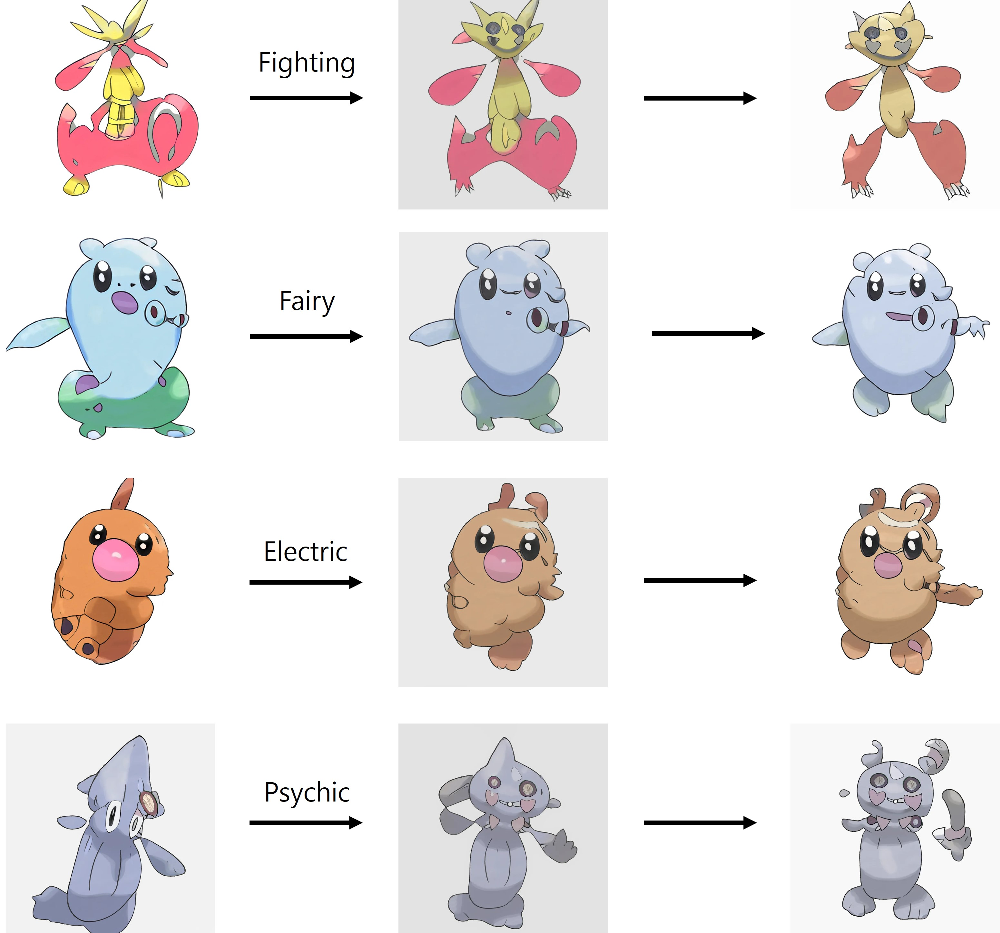

<div align="center">
  <h1>Pokémon Generator</h1>
  <a href='https://huggingface.co/spaces/gibiee/Pokemon-Generator'></a>
</div>

You can generate a base Pokémon image randomly, then edit the class information.

### Random Generation
<div align="center">
  
</div>

### Edit by Class
<div align="center">
  <span>&nbsp;&nbsp;&nbsp;</span>
</div>


## More Information
<details>
<summary>Development</summary>

## Installation

### Environment Setup
```sh
conda env create -f stylegan-xl/environment.yml

conda install pandas pillow tdqm
pip install selenium undetected-chromedriver
```

## Preparing Dataset

### Crawling Pokémon images : `crawling.py`
- GUI 환경에서 실행하기를 권장
- 웹 사이트에서 총 1025장의 이미지를 크롤링 : https://www.pokemon.com/us/pokedex
- 수집한 이미지를 1024x1024 해상도로 resize 후 저장
- 속성(type) 정보를 표로 정리하여 `info.csv` 파일으로 저장

## Feature Extraction

### Run inversion of the dataset : `run_inversion_custom.py`
- StyleGAN-XL 기반의 inversion 진행
- PTI 옵션을 적용하지 않을 때, 범용성이 더 높음.

</details>
